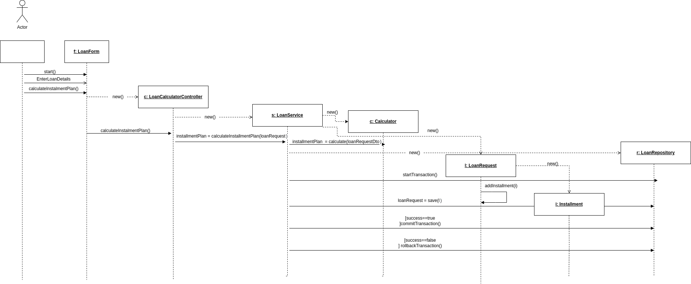

# Loan Calculator App

The aim of this project is to provide a user with the tool necessary to calculate their installment plan based on the loan amount, annual interest percentage and number of months.

## Requirements

-   Docker
-   Docker Compose

## Installation

1.  Clone the repository:

`git clone https://github.com/milicamasal/loan-calculator.git`

2.  Navigate to the project directory:

`cd loan-calculator`

4.  Start the application using docker-compose:

`docker-compose up`

4.  Access the swagger UI at [http://localhost:8080/swagger-ui/](http://localhost:8080/swagger-ui/).

## Diagrams

In the section below you can find class and sequence diagrams.

### Class diagram

### Sequence diagram

